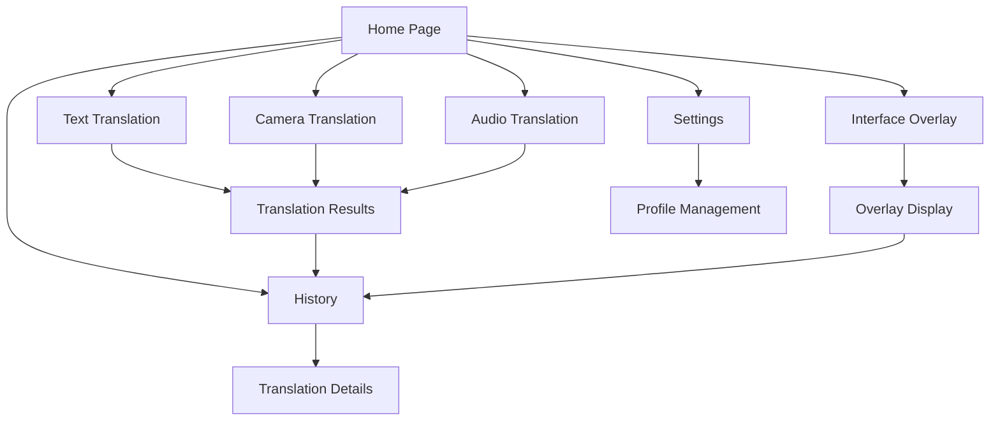
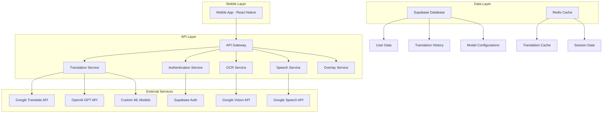
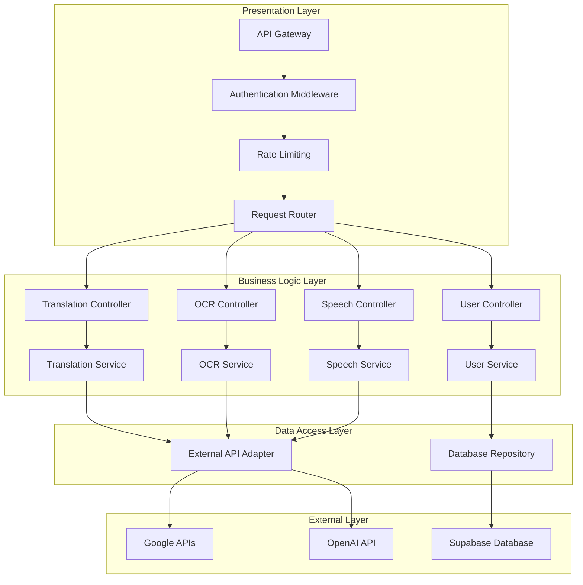
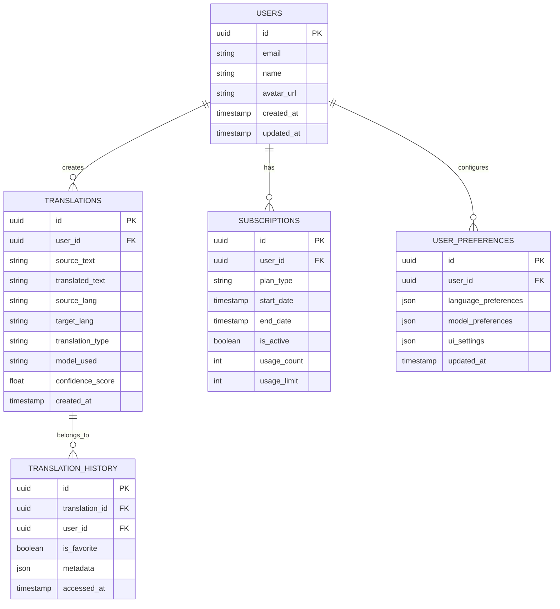

# Translation Filter - Comprehensive Technical Plan

## 1. Product Overview

Translation Filter is an innovative mobile application that provides comprehensive translation services including text, image, and audio translation, with a groundbreaking "Mobile Interface Translation" feature that automatically translates all visible text on mobile interfaces while preserving original UI element presentation.

The application addresses the growing need for seamless multilingual communication and interface accessibility, targeting global users who frequently interact with foreign language content on their mobile devices. The unique interface translation overlay feature positions this product as a market leader in mobile accessibility solutions.

## 2. Core Features

### 2.1 User Roles

| Role | Registration Method | Core Permissions |
|------|---------------------|------------------|
| Free User | Email/Social registration | Basic text translation, limited daily usage |
| Premium User | Subscription upgrade | Unlimited translations, advanced features, priority processing |
| Enterprise User | Corporate license | Team management, custom models, analytics dashboard |

### 2.2 Feature Module

Our Translation Filter application consists of the following main features:
1. **Text Translation**: Manual text input, clipboard integration, real-time typing translation
2. **Image Translation**: Camera capture, gallery import, OCR processing, overlay translation
3. **Audio Translation**: Voice recording, real-time speech translation, text-to-speech output
4. **Mobile Interface Translation**: Screen overlay, UI element detection, contextual translation preservation
5. **Translation Management**: History tracking, favorites, offline mode, custom dictionaries
6. **Settings & Profile**: Language preferences, model selection, subscription management

### 2.3 Page Details

| Page Name | Module Name | Feature description |
|-----------|-------------|---------------------|
| Home | Quick Actions | Access all translation modes, recent translations, language switcher |
| Text Translation | Input Interface | Text input field, clipboard paste, real-time translation, copy/share results |
| Camera Translation | Image Processing | Camera viewfinder, capture button, gallery access, OCR overlay display |
| Audio Translation | Voice Interface | Record button, audio waveform, playback controls, transcript display |
| Interface Overlay | Screen Translation | Floating activation button, UI element detection, translation overlay management |
| History | Translation Log | Chronological list, search/filter, favorites, export options |
| Settings | Configuration | Language pairs, translation models, overlay preferences, account management |
| Profile | User Management | Subscription status, usage statistics, sync settings, support access |

## 3. Core Process

### Standard Translation Flow
1. User opens app and selects translation mode (text/image/audio)
2. User inputs content through respective interface
3. App processes content using selected translation model
4. Translated result is displayed with options to save, share, or modify
5. Translation is automatically saved to history

### Mobile Interface Translation Flow
1. User activates interface translation overlay from any screen
2. App captures current screen content and detects UI text elements
3. System processes detected text through translation engine
4. Translated text is overlaid on original UI elements while preserving layout
5. User can toggle between original and translated views



## 4. User Interface Design

### 4.1 Design Style

- **Primary Colors**: Deep Blue (#1E3A8A), Accent Teal (#14B8A6)
- **Secondary Colors**: Light Gray (#F8FAFC), Dark Gray (#374151)
- **Button Style**: Rounded corners (12px radius), subtle shadows, gradient backgrounds
- **Typography**: Inter font family, 16px base size, clear hierarchy with 14px-24px range
- **Layout Style**: Card-based design, bottom navigation, floating action buttons
- **Icons**: Outline style with 2px stroke, consistent sizing, translation-themed iconography

### 4.2 Page Design Overview

| Page Name | Module Name | UI Elements |
|-----------|-------------|-------------|
| Home | Quick Actions | Grid layout with large action cards, gradient backgrounds, prominent language selector |
| Text Translation | Input Interface | Split-screen layout, floating input field, real-time preview, material design buttons |
| Camera Translation | Image Processing | Full-screen camera view, overlay controls, semi-transparent result cards |
| Audio Translation | Voice Interface | Circular record button, animated waveform, clean transcript layout |
| Interface Overlay | Screen Translation | Minimal floating controls, transparent overlay, highlighted translated elements |
| History | Translation Log | List view with swipe actions, search bar, filter chips, infinite scroll |
| Settings | Configuration | Grouped settings with toggle switches, dropdown selectors, progress indicators |

### 4.3 Responsiveness

The application is designed mobile-first with adaptive layouts for various screen sizes. Touch interaction optimization includes gesture support for overlay controls, haptic feedback for key actions, and accessibility features for users with disabilities.

---

# Technical Architecture Document

## 1. Architecture Design



## 2. Technology Description

- **Frontend**: React Native@0.72 + TypeScript + React Navigation + React Native Reanimated
- **Backend**: Node.js@18 + Express@4 + TypeScript
- **Database**: Supabase (PostgreSQL) + Redis for caching
- **Cloud Infrastructure**: AWS (EC2, S3, CloudFront) + Supabase hosting
- **Translation APIs**: Google Translate API, OpenAI GPT-4, Azure Translator
- **Additional Services**: Google Vision API (OCR), Google Speech-to-Text API

## 3. Route Definitions

| Route | Purpose |
|-------|---------|
| /home | Main dashboard with quick access to all translation features |
| /text-translate | Text input and translation interface |
| /camera-translate | Camera-based image translation |
| /audio-translate | Voice recording and audio translation |
| /overlay | Interface overlay activation and management |
| /history | Translation history and saved translations |
| /settings | App configuration and user preferences |
| /profile | User account management and subscription |
| /login | Authentication and user registration |

## 4. API Definitions

### 4.1 Core API

**Text Translation**
```
POST /api/translate/text
```

Request:
| Param Name | Param Type | isRequired | Description |
|------------|------------|------------|-------------|
| text | string | true | Text content to translate |
| sourceLang | string | true | Source language code |
| targetLang | string | true | Target language code |
| model | string | false | Translation model preference |

Response:
| Param Name | Param Type | Description |
|------------|------------|-------------|
| translatedText | string | Translated content |
| confidence | number | Translation confidence score |
| model | string | Model used for translation |

**Interface Translation**
```
POST /api/translate/interface
```

Request:
| Param Name | Param Type | isRequired | Description |
|------------|------------|------------|-------------|
| screenshot | string | true | Base64 encoded screenshot |
| elements | array | true | Detected UI elements with coordinates |
| sourceLang | string | true | Source language code |
| targetLang | string | true | Target language code |

Response:
| Param Name | Param Type | Description |
|------------|------------|-------------|
| translations | array | Array of translated elements with positions |
| processingTime | number | Time taken for processing |

## 5. Server Architecture



## 6. Data Model

### 6.1 Data Model Definition



### 6.2 Data Definition Language

**Users Table**
```sql
CREATE TABLE users (
    id UUID PRIMARY KEY DEFAULT gen_random_uuid(),
    email VARCHAR(255) UNIQUE NOT NULL,
    name VARCHAR(100) NOT NULL,
    avatar_url TEXT,
    created_at TIMESTAMP WITH TIME ZONE DEFAULT NOW(),
    updated_at TIMESTAMP WITH TIME ZONE DEFAULT NOW()
);

CREATE INDEX idx_users_email ON users(email);
```

**Translations Table**
```sql
CREATE TABLE translations (
    id UUID PRIMARY KEY DEFAULT gen_random_uuid(),
    user_id UUID REFERENCES users(id) ON DELETE CASCADE,
    source_text TEXT NOT NULL,
    translated_text TEXT NOT NULL,
    source_lang VARCHAR(10) NOT NULL,
    target_lang VARCHAR(10) NOT NULL,
    translation_type VARCHAR(20) NOT NULL CHECK (translation_type IN ('text', 'image', 'audio', 'interface')),
    model_used VARCHAR(50) NOT NULL,
    confidence_score FLOAT DEFAULT 0.0,
    created_at TIMESTAMP WITH TIME ZONE DEFAULT NOW()
);

CREATE INDEX idx_translations_user_id ON translations(user_id);
CREATE INDEX idx_translations_created_at ON translations(created_at DESC);
CREATE INDEX idx_translations_type ON translations(translation_type);
```

**Translation History Table**
```sql
CREATE TABLE translation_history (
    id UUID PRIMARY KEY DEFAULT gen_random_uuid(),
    translation_id UUID REFERENCES translations(id) ON DELETE CASCADE,
    user_id UUID REFERENCES users(id) ON DELETE CASCADE,
    is_favorite BOOLEAN DEFAULT FALSE,
    metadata JSONB,
    accessed_at TIMESTAMP WITH TIME ZONE DEFAULT NOW()
);

CREATE INDEX idx_translation_history_user_id ON translation_history(user_id);
CREATE INDEX idx_translation_history_accessed_at ON translation_history(accessed_at DESC);
```

**Subscriptions Table**
```sql
CREATE TABLE subscriptions (
    id UUID PRIMARY KEY DEFAULT gen_random_uuid(),
    user_id UUID REFERENCES users(id) ON DELETE CASCADE,
    plan_type VARCHAR(20) NOT NULL CHECK (plan_type IN ('free', 'premium', 'enterprise')),
    start_date TIMESTAMP WITH TIME ZONE NOT NULL,
    end_date TIMESTAMP WITH TIME ZONE,
    is_active BOOLEAN DEFAULT TRUE,
    usage_count INTEGER DEFAULT 0,
    usage_limit INTEGER DEFAULT 100,
    created_at TIMESTAMP WITH TIME ZONE DEFAULT NOW()
);

CREATE INDEX idx_subscriptions_user_id ON subscriptions(user_id);
CREATE INDEX idx_subscriptions_active ON subscriptions(is_active);
```

**User Preferences Table**
```sql
CREATE TABLE user_preferences (
    id UUID PRIMARY KEY DEFAULT gen_random_uuid(),
    user_id UUID REFERENCES users(id) ON DELETE CASCADE,
    language_preferences JSONB DEFAULT '{}',
    model_preferences JSONB DEFAULT '{}',
    ui_settings JSONB DEFAULT '{}',
    updated_at TIMESTAMP WITH TIME ZONE DEFAULT NOW()
);

CREATE UNIQUE INDEX idx_user_preferences_user_id ON user_preferences(user_id);
```

**Initial Data**
```sql
-- Insert default language preferences
INSERT INTO user_preferences (user_id, language_preferences, model_preferences, ui_settings)
SELECT 
    id,
    '{"defaultSource": "auto", "defaultTarget": "en", "recentLanguages": []}',
    '{"preferredModel": "google", "fallbackModel": "openai"}',
    '{"theme": "light", "overlayOpacity": 0.8, "autoDetect": true}'
FROM users;
```

---

# Implementation Roadmap

## Phase 1: Foundation Setup (Weeks 1-3)

### Week 1: Project Initialization
- Set up development environment and repositories
- Configure React Native project with TypeScript
- Set up Supabase database and authentication
- Implement basic navigation structure
- Create initial UI components and design system

### Week 2: Core Infrastructure
- Develop API gateway and authentication middleware
- Implement user registration and login flows
- Set up database schemas and initial migrations
- Create basic translation service architecture
- Integrate Google Translate API for text translation

### Week 3: Basic Translation Features
- Implement text translation interface
- Add translation history functionality
- Create user preferences and settings
- Develop offline translation capabilities
- Implement basic error handling and validation

## Phase 2: Advanced Translation Features (Weeks 4-7)

### Week 4: Image Translation
- Integrate Google Vision API for OCR
- Develop camera interface and image capture
- Implement image preprocessing and text extraction
- Create overlay system for translated text on images
- Add gallery import functionality

### Week 5: Audio Translation
- Integrate Google Speech-to-Text API
- Implement voice recording interface
- Develop real-time audio processing
- Add text-to-speech for translated content
- Create audio playback and transcript features

### Week 6: LLM Integration
- Integrate OpenAI GPT API for advanced translations
- Implement model selection and switching
- Develop context-aware translation features
- Add translation quality scoring
- Create custom prompt engineering for better results

### Week 7: Performance Optimization
- Implement caching strategies with Redis
- Optimize API response times
- Add request batching and queue management
- Implement progressive loading and lazy loading
- Conduct performance testing and optimization

## Phase 3: Mobile Interface Translation (Weeks 8-11)

### Week 8: Screen Capture and Analysis
- Implement screen capture functionality
- Develop UI element detection algorithms
- Create coordinate mapping system
- Add text extraction from UI elements
- Implement accessibility service integration

### Week 9: Overlay System Development
- Create floating overlay interface
- Implement transparent translation layers
- Develop position-aware text rendering
- Add gesture controls for overlay management
- Create toggle between original and translated views

### Week 10: Advanced Overlay Features
- Implement real-time translation updates
- Add contextual translation preservation
- Develop smart text sizing and positioning
- Create overlay customization options
- Add support for different UI frameworks

### Week 11: Integration and Testing
- Integrate overlay system with main app
- Implement cross-app functionality
- Add permission management for screen access
- Conduct extensive testing on various apps
- Optimize overlay performance and battery usage

## Phase 4: Polish and Deployment (Weeks 12-14)

### Week 12: UI/UX Refinement
- Conduct user testing and feedback collection
- Refine interface design and user flows
- Implement accessibility features
- Add animations and micro-interactions
- Optimize for different screen sizes and devices

### Week 13: Quality Assurance
- Comprehensive testing across all features
- Security audit and vulnerability assessment
- Performance testing and optimization
- API rate limiting and error handling
- Documentation and code review

### Week 14: Deployment and Launch
- Prepare app store submissions
- Set up production infrastructure
- Implement monitoring and analytics
- Create user onboarding and tutorials
- Launch marketing and user acquisition campaigns

---

# Minimum Viable Product (MVP) Plan

## MVP Core Features

The MVP will focus on demonstrating the unique Mobile Interface Translation functionality while providing essential translation capabilities:

### Essential Features
1. **Basic Text Translation**: Manual input with Google Translate integration
2. **Mobile Interface Translation**: Screen overlay with UI text detection and translation
3. **User Authentication**: Simple email registration and login
4. **Translation History**: Basic storage and retrieval of past translations
5. **Language Selection**: Support for 10 major language pairs

### MVP Technology Stack

- **Frontend**: React Native@0.72 + TypeScript (simplified UI components)
- **Backend**: Supabase (serverless functions + database)
- **Translation**: Google Translate API only (no LLM integration)
- **Infrastructure**: Supabase hosting + Vercel for web dashboard
- **Database**: Supabase PostgreSQL (simplified schema)

## MVP Implementation Steps

### Phase 1: Core Setup (Week 1)
1. Initialize React Native project with basic navigation
2. Set up Supabase project and authentication
3. Create simplified database schema (users, translations only)
4. Implement basic UI components and design system
5. Set up Google Translate API integration

### Phase 2: Basic Translation (Week 2)
1. Develop text translation interface
2. Implement Google Translate API calls
3. Create translation history storage
4. Add language selection dropdown
5. Implement basic error handling

### Phase 3: Interface Translation Core (Week 3)
1. Implement screen capture functionality
2. Develop basic UI text detection
3. Create simple overlay system
4. Add translation overlay rendering
5. Implement toggle between original and translated views

### Phase 4: Integration and Polish (Week 4)
1. Integrate overlay with main app navigation
2. Add permission handling for screen access
3. Implement basic user onboarding
4. Conduct testing on 3-5 popular apps
5. Prepare demo and documentation

## MVP Success Metrics

- **Technical Feasibility**: Successfully translate UI text in 80% of tested apps
- **User Experience**: Complete translation workflow in under 10 seconds
- **Accuracy**: Achieve 85%+ translation accuracy for common UI elements
- **Performance**: Overlay activation within 2 seconds
- **Compatibility**: Work on iOS 14+ and Android 10+ devices

## Scalability Architecture

The MVP architecture is designed for future expansion:

### Modular Design
- **Translation Engine**: Abstracted to support multiple providers
- **UI Detection**: Pluggable algorithms for different detection methods
- **Overlay System**: Component-based for easy customization
- **API Layer**: RESTful design ready for microservices migration

### Future Expansion Points
1. **LLM Integration**: Add OpenAI GPT support through existing translation interface
2. **Advanced OCR**: Upgrade to custom ML models for better UI text detection
3. **Multi-Modal Translation**: Add image and audio translation modules
4. **Enterprise Features**: Team management, custom models, analytics dashboard
5. **Cross-Platform**: Web extension and desktop app using shared core logic

### Technical Debt Management
- Use TypeScript for type safety and easier refactoring
- Implement comprehensive testing from MVP stage
- Document API contracts for future backend migration
- Design database schema with future features in mind
- Use feature flags for gradual rollout of new capabilities

The MVP provides a solid foundation that validates the core concept while maintaining flexibility for rapid iteration and feature expansion based on user feedback and market demands.